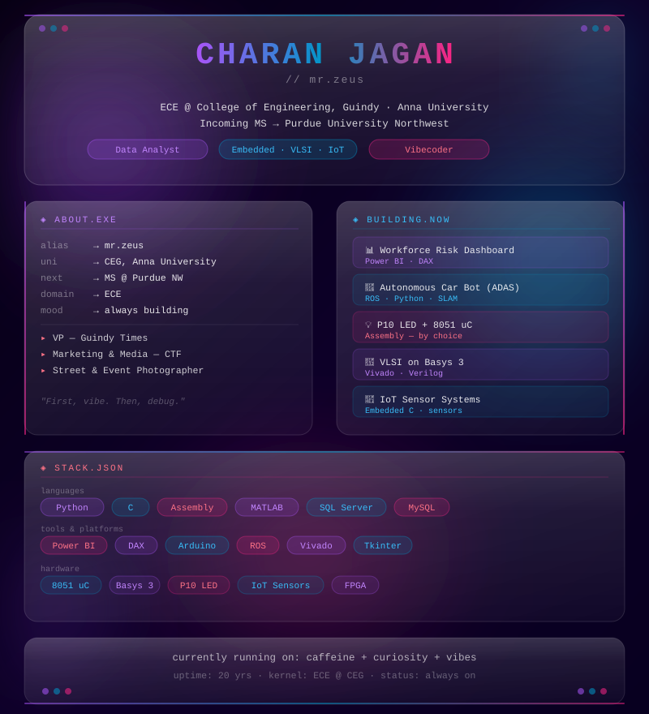

<!-- ═══════════════════════════════════════════════════
     CHARAN JAGAN — GitHub Profile README
     Replace YOUR_GITHUB_USERNAME with: mr-zeus (or your actual handle)
     ═══════════════════════════════════════════════════ -->

<div align="center">

<!-- ── ANIMATED TYPING HEADER ── -->


<br/>

<!-- ── GLASSMORPHISM BANNER ── -->


<br/>

<!-- ── WAVE DIVIDER (from readme-design-kit) ── -->


</div>

---

## 🧑‍💻 About Me

<table>
<tr>
<td width="55%" valign="top">

```yaml
name     : Charan Jagan
alias    : mr.zeus
uni      : CEG, Anna University
degree   : B.E. — ECE
next     : MS @ Purdue University NW
domain   : Data · Embedded · VLSI · IoT
mood     : always building something
```

📌 **VP** — Guindy Times  
📌 **Marketing & Media** — CEG Tech Forum  
📸 **Street & Event Photographer**

> *"First, vibe. Then, debug."*

</td>
<td width="45%" valign="top">

```javascript
const charan = {
  currently  : "Power BI DAX sorcery",
  obsessed   : ["dashboards that slap",
                "circuits that don't fry"],
  hardware   : ["8051 uC", "Basys 3",
                "P10 LED", "IoT Sensors"],
  superpower : "vibecoding",
  fuel       : "☕ × ∞"
};
```

</td>
</tr>
</table>

---

## 📊 GitHub Stats

<div align="center">

<!-- ── STATS CARD + TOP LANGUAGES ── -->


<br/><br/>

<!-- ── STREAK STATS ── -->


</div>

---

## 📈 Gradient 3D Animated Activity Graph

<div align="center">

<!-- ── GRADIENT 3D ANIMATED GRAPH (readme-design-kit element) ── -->


</div>

---

## ⚡ Tech Stack

<div align="center">

<!-- ── SKILL ICONS (from skill-icons.vercel.app) ── -->

**Languages**

[](https://skillicons.dev)

**Tools & Platforms**

[](https://skillicons.dev)

<br/>

<!-- ── TECH BADGES (glassmorphism-styled) ── -->


</div>

---

## 🔨 Currently Building

| Project | Stack | Status |
|---|---|:---:|
| 📊 Workforce Risk Dashboard | Power BI · DAX · IBM HR Analytics | 🟢 Active |
| 🤖 Autonomous Car Bot (ADAS) | ROS · Python · SLAM | 🟡 Paused |
| 💡 P10 LED + 8051 uC | Pure Assembly | 🟢 Active |
| 🔲 VLSI on Basys 3 | Vivado · Verilog | 🟢 Active |
| 📡 IoT Sensor Systems | Embedded C · sensors | 🟡 Ongoing |
| 🗃️ SQL Server Portfolio | SSMS · T-SQL · Window Functions | 🟢 Active |

---

<div align="center">

<!-- ── WAVE FOOTER ── -->


<!-- ── SOCIAL LINKS ── -->
[](https://linkedin.com/in/YOUR_LINKEDIN)
[](https://github.com/YOUR_GITHUB_USERNAME)
[](mailto:YOUR_EMAIL)

<br/>

<!-- ── PROFILE VIEW COUNTER ── -->


<br/>

*currently running on: caffeine + curiosity + vibes*  
*uptime: 20 yrs · kernel: ECE @ CEG · status: always on*

</div>
